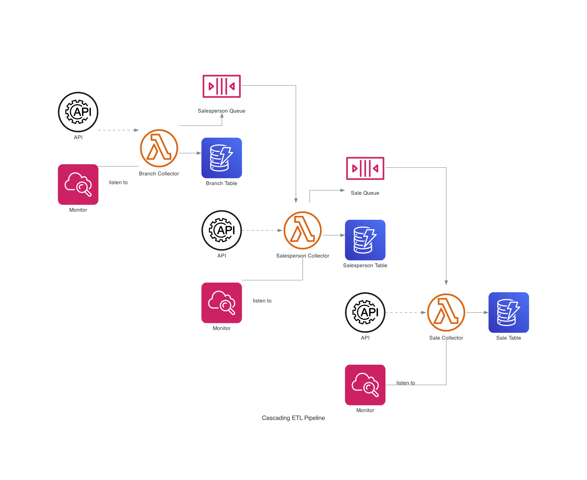

# Cascading ETL pipeline
Tutorial of AWS-based ETL pipeline development

## ERD


## Running this repo
### Prerequisite: [SAM CLI](https://docs.aws.amazon.com/serverless-application-model/latest/developerguide/install-sam-cli.html)

- Environment setup
In each folder, run
```
pip install -r requirements.txt
```

- Dependencies:
```
for d in */; do cp utils.py "$d"; done
```

- Build:
```
sam build -u
```
- Local Testing:
```
sam local invoke "BranchCollector" -e branch.json --env-vars env.json
sam local invoke "SalespersonCollector" -e branch.json --env-vars env.json
sam local invoke "SalesCollector" -e branch.json --env-vars env.json
```
- Deploy:
```
sam deploy --parameter-overrides Environment=dev --confirm-changeset --no-fail-on-empty-changeset --capabilities CAPABILITY_NAMED_IAM --stack-name test-ETL-stack --s3-bucket unique-bucket-name 
```